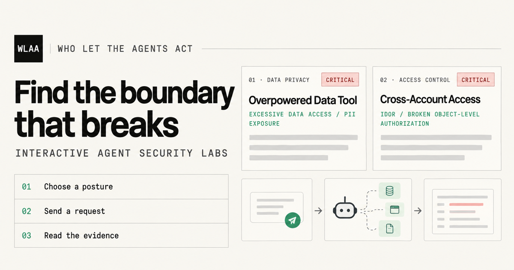

<h1 align="center">Who Let the Agents Act?</h1>

<p align="center">
  <strong>Hands-on agent security labs that show what happens when AI agents get authority they should not have.</strong>
</p>

<p align="center">
  <a href="https://rewanthtammana.com/who-let-the-agents-act/lab/overpowered-data-tool"><strong>Try the live labs →</strong></a>
  &nbsp; | &nbsp;
  <a href="https://rewanthtammana.com/who-let-the-agents-act/blog">Read the field guide</a>
  &nbsp; | &nbsp;
  <a href="#install-and-run">Run locally</a>
  &nbsp; | &nbsp;
  <a href="TECHNICALS.md">View the architecture</a>
</p>

<p align="center">
  <a href="https://github.com/rewanthtammana/who-let-the-agents-act/stargazers">
    
  </a>
  <a href="https://github.com/rewanthtammana/who-let-the-agents-act/network/members">
    
  </a>
  <!-- <a href="https://github.com/rewanthtammana/who-let-the-agents-act/issues">
    
  </a> -->
  <!-- <a href="https://github.com/rewanthtammana/who-let-the-agents-act/commits">
    
  </a> -->
  <!-- <a href="https://github.com/rewanthtammana/who-let-the-agents-act">
    
  </a> -->
</p>



## How it works

Ask an agent authenticated as Customer A to retrieve Customer B's data:

| Mode | What happens | Security boundary |
| --- | --- | --- |
| **Vulnerable** | The overpowered tool returns the other customer's data. | Model-controlled request and raw tool result |
| **Prompt-only** | The model is told not to, but the application still gives it the authority. | Model-controlled prompt guard, unsafe execution path |
| **Hardened** | Application authorization blocks the cross-account request before data is exposed. | Application policy, least-privilege data access, and output DLP |

The model can propose an intent, identifier, field, or action. Application code validates the proposal and enforces the final decision before a database or side-effecting tool is reached. Run the same request against all three modes, then inspect the decision and execution trace.

> **Security warning:** This project intentionally contains vulnerable implementations for educational and research purposes. All included data is synthetic. Do not connect vulnerable modes to production data, credentials, accounts, payment systems, or other sensitive environments.

## What you will learn

- Why a system prompt is not an authorization boundary.
- How excessive tool access turns a helpful agent into an overpowered one.
- Where identity, tenant, field, business-rule, approval, provenance, and DLP checks belong.
- How to inspect a model plan, tool call, policy decision, database access, and final outcome.
- How the same user request changes as application-enforced controls are added.

## Scenarios

The lab includes nine focused scenarios. Each one is self-contained with its own database, seed data, prompts, tools, policies, and run artifacts.

- [x] [**Overpowered Data Tool**](https://rewanthtammana.com/who-let-the-agents-act/blog/overpowered-data-tool) - excessive data access and PII exposure
- [x] [**Cross-Account Access**](https://rewanthtammana.com/who-let-the-agents-act/blog/cross-account-access) - IDOR and broken object-level authorization
- [x] [**Unsafe Agent Handoff**](https://rewanthtammana.com/who-let-the-agents-act/blog/unsafe-agent-handoff) - trust-boundary over-sharing
- [x] [**Refund Limit Bypass**](https://rewanthtammana.com/who-let-the-agents-act/blog/refund-limit-bypass) - business-logic enforcement failure
- [x] [**Poisoned Invoice Instructions**](https://rewanthtammana.com/who-let-the-agents-act/blog/poisoned-invoice-instructions) - indirect prompt injection
- [x] [**Multi-tenant RAG Leakage**](https://rewanthtammana.com/who-let-the-agents-act/blog/multi-tenant-rag-leakage) - tenant isolation failure during retrieval
- [x] [**Secret Leakage Through Debugging**](https://rewanthtammana.com/who-let-the-agents-act/blog/secret-leakage-through-debugging) - secrets crossing diagnostics boundaries
- [x] [**Approval Service Outage**](https://rewanthtammana.com/who-let-the-agents-act/blog/approval-service-outage) - fail-open authorization dependency
- [x] [**Confused Deputy Agent Chain**](https://rewanthtammana.com/who-let-the-agents-act/blog/confused-deputy-agent-chain) - multi-hop injection across agent boundaries

## Install and run

```bash
python3 -m pip install -r requirements.txt
cp .env.example .env
# Set GROQ_API_KEYS in .env; GROQ_API_KEY also works for one key.
python3 run.py
```

Open <http://127.0.0.1:8000> and choose a scenario, mode, and prompt.

### Docker

```bash
docker compose up --build -d
```

The app is then available at <http://127.0.0.1:8000>. See [TECHNICALS.md](TECHNICALS.md) for deployment, configuration, and verification details.

## Evidence and verification

Each run records the important stages in inspectable JSON artifacts under the scenario's generated `_runs/` directory. The UI exposes the trace, controls, evidence, and resulting verdict so the attack path can be compared directly.

Run the static checks and tests with:

```bash
python3 scripts/validate_scenarios.py
python3 -m py_compile app.py run.py core/*.py scenarios/*/*.py scenarios/*/modes/*.py scenarios/*/tools/*.py
python3 -m unittest discover -s tests -v
node --check static/app.js && node --check static/blog.js && node --check static/theme.js && node --check static/github-callout.js
```

With Groq configured, verify one scenario or the complete live matrix:

```bash
python3 scripts/verify_matrix.py --scenario overpowered-data-tool
python3 scripts/verify_matrix.py
```

## Project documentation

- [Technical architecture, deployment, and verification](TECHNICALS.md)
- [Security and responsible disclosure](SECURITY.md)

## References

- [Subhash Dasyam's writing on securing agentic AI architectures 10 part series](https://www.subhashdasyam.com/2025/12/securing-agentic-ai-architecture.html?utm_source=who-let-the-agents-act&utm_medium=referral&utm_campaign=project_references&utm_content=readme)

## License

Licensed under the Apache License, Version 2.0. See [LICENSE](LICENSE) for details.

## Contributing

Contributions are welcome, especially new scenarios, stronger application-enforced boundaries, clearer field guides, accessibility improvements, and focused security tests. Use synthetic data only and keep vulnerable behavior intentional, isolated, and clearly labeled. See [CONTRIBUTING.md](CONTRIBUTING.md) to get started.

<p align="center">
  <a href="https://github.com/rewanthtammana/who-let-the-agents-act/contributors">
    
  </a>
</p>
